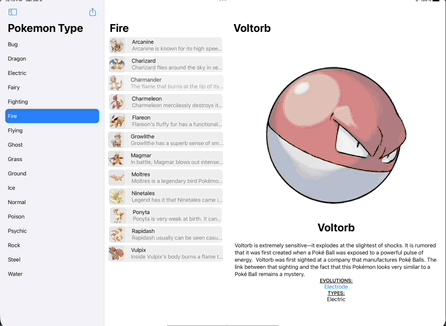

# Sample projects for Flock of Swifts meetup on 9-July-2022

Demonstration of the new Navigation API's in iOS16.  We dicussed:
  * Using an `actor` for the service layer
  * `NavigationSplitView`
  * `NavigationStack`
  * `NavigationPath`
  * Deep linking and deserialization of NavigationPath to JSON
  * State restoration with @SceneStorage (not the save interval is infrequent, use @AppStorage if you want to see it work more reliably)
 

